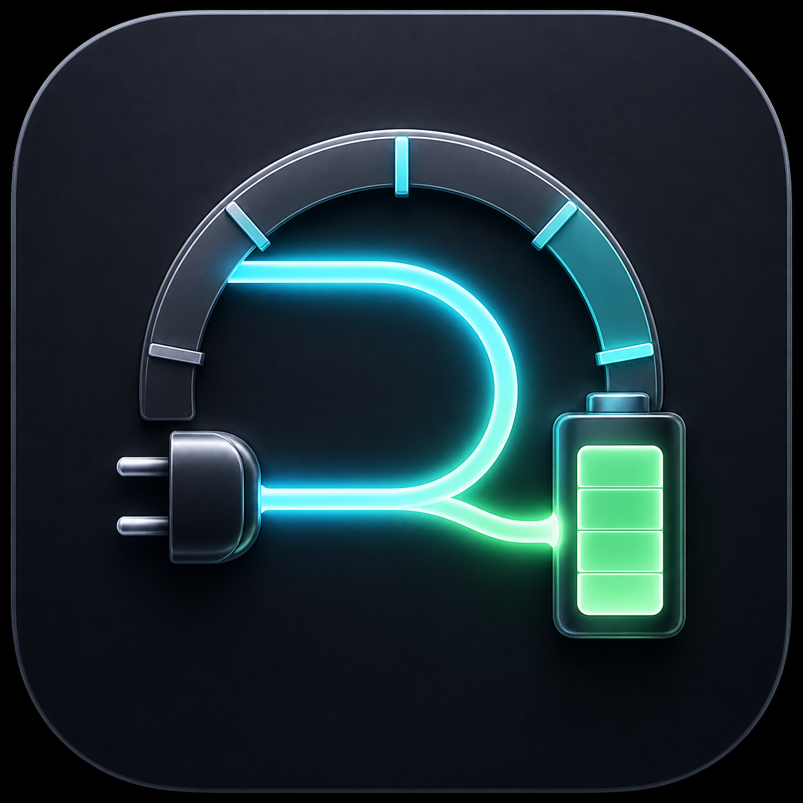

# Drawstate

<p align="center">
  
</p>

Drawstate is a native, open-source macOS menu-bar utility for live power and battery telemetry. It shows how much power your Mac is receiving or consuming, battery percentage, power flow, and estimated time until full or empty.

Created by **Kian Konrad Tajbakhsh** and released under the [MIT License](LICENSE).

## Highlights

- Live signed wattage in the menu bar
- Battery percentage inside a level-aware battery icon
- Time until full or empty with smoothed fallback estimates
- Adapter input, Mac load, and battery charge or supply flow
- Battery health, voltage, current, cycles, and charger capability
- Native Command-drag menu-bar positioning
- Native adaptive app icon with Default, Dark, and Monochrome appearances
- Integrated settings with individually configurable features
- Optional start at login through the standard macOS login-item service
- No account, cloud service, administrator access, analytics, or network connection

See [the complete feature guide](docs/FEATURES.md).

## Requirements

- macOS 14 Sonoma or later
- Apple Silicon or Intel Mac

Some measurements depend on what a particular Mac and charger expose. Missing readings appear as `—` rather than zero.

## Install

### GitHub download

Download the latest notarized `Drawstate-VERSION.zip` from [GitHub Releases](https://github.com/Kian-hdr/Drawstate/releases), unzip it, and move `Drawstate.app` to Applications.

Public binaries are published only after Developer ID signing and Apple notarization. If the Releases page has no binary yet, build from source instead of downloading an unsigned copy from another source.

### Homebrew

After the first signed release and tap publication:

```sh
brew tap Kian-hdr/drawstate
brew install --cask drawstate
```

Upgrade or uninstall with:

```sh
brew upgrade --cask drawstate
brew uninstall --cask drawstate
```

### Build from source

Install Xcode, then run:

```sh
git clone https://github.com/Kian-hdr/Drawstate.git
cd Drawstate
swift test
./Scripts/package-app.sh release
open build/Drawstate.app
```

The local package script uses ad-hoc signing unless `DRAWSTATE_SIGNING_IDENTITY` is provided. Ad-hoc builds are for development and may require local Gatekeeper approval.

## Using Drawstate

Launch Drawstate and click its battery item in the menu bar. The overview panel shows live system, adapter, and battery flow. Open **Settings** inside the panel to choose exactly which icon, percentage, wattage, runtime, cards, and details appear.

Positive wattage means the Mac or battery is receiving adapter power. Negative wattage means the battery is supplying power. Readings are system telemetry estimates, not calibrated electrical-meter measurements.

### Charge limits

Drawstate always displays the system charge limit when macOS exposes it. Changing that limit is an optional experimental feature under **Settings > Experimental**. It uses an undocumented on-device macOS Smart Charge service, verifies every write, and may stop working after an OS update. It is not suitable for a Mac App Store build.

## Privacy

All processing stays on the Mac. Drawstate does not collect or transmit data. Read the full [privacy statement](PRIVACY.md) and bundled privacy manifest.

## Documentation

- [Features](docs/FEATURES.md)
- [Architecture](docs/ARCHITECTURE.md)
- [Building and releasing](docs/RELEASING.md)
- [App icon design](docs/APP-ICON.md)
- [Contributing](CONTRIBUTING.md)
- [Support](SUPPORT.md)
- [Security policy](SECURITY.md)
- [Uninstall](UNINSTALL.md)
- [Changelog](CHANGELOG.md)

## Development

```sh
swift test
./Scripts/package-app.sh release
codesign --verify --deep --strict --verbose=2 build/Drawstate.app
```

AI coding tools should read [AGENTS.md](AGENTS.md) before modifying the project. It documents the status-item lifecycle, telemetry semantics, preferences, installation paths, and required validation.

## License

Drawstate is available under the [MIT License](LICENSE).
